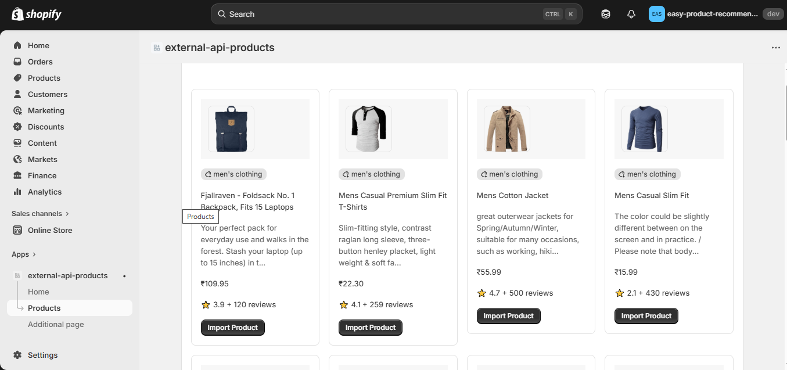
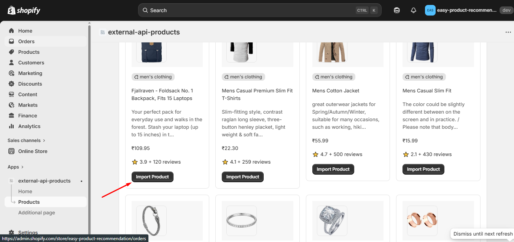
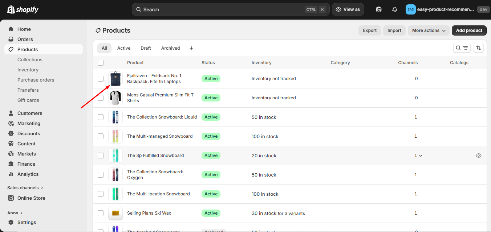

# 🛍️ Shopify Product Importer App

> 🚀 This project demonstrates real-world Shopify app development including external API integration and product creation via GraphQL.

---

## 🎥 Live Demo

[](https://youtu.be/-yMVK8NeoRs)

---

## ✨ Features

* 🔄 Fetch products from external API
* 🖼️ Display products in a clean UI
* 📥 Import individual products into Shopify store
* ⚡ Create products using Shopify Admin GraphQL API
* 🔔 Loading states and user feedback

---

## 🧠 Tech Stack

* React Router
* Shopify App CLI
* Shopify Admin GraphQL API
* Polaris (UI Components)
* Node.js

---

## 🌐 API Used

* https://fakestoreapi.com/products/

---

## 📸 Screenshots

### 🖥️ Product Listing UI



### 📦 Import Button Action



### ✅ Product Created in Shopify Admin



---

## ⚙️ How It Works

1. Fetch products from external API
2. Display them in the app UI
3. Click the **Import** button
4. Send GraphQL mutation to Shopify
5. Product gets created in the Shopify store

---

## 🚀 Getting Started

### Prerequisites

* Node.js (v18 recommended)
* Shopify CLI
* Shopify Partner Account

---

## 📦 Installation

```bash
git clone https://github.com/your-username/your-repo-name.git
cd your-repo-name
npm install
```

---

## ▶️ Run the App

```bash
shopify app dev
```

Press **P** to open the app and install it on your development store.

---

## 🔥 GraphQL Product Create Example

```js
mutation productCreate($input: ProductInput!) {
  productCreate(input: $input) {
    product {
      id
      title
    }
    userErrors {
      field
      message
    }
  }
}
```

---

## 📁 Project Structure

```
/app
  /routes
    app.product.jsx
  shopify.server.js
/prisma
/screenshots
```

---

## 📌 Future Improvements

* 🚀 Bulk product import
* 🧠 Duplicate product detection
* 🏷️ Category & collection mapping
* 📦 Variant & inventory support
* 🎨 Improved UI with Polaris

---

## 🤝 Contributing

Pull requests are welcome. For major changes, please open an issue first.

---

## 📄 License

MIT
